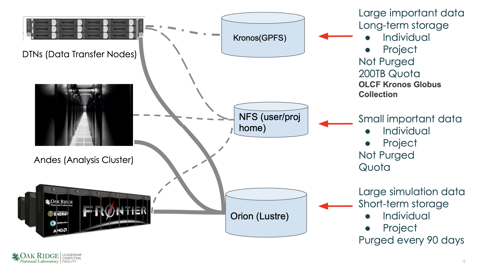
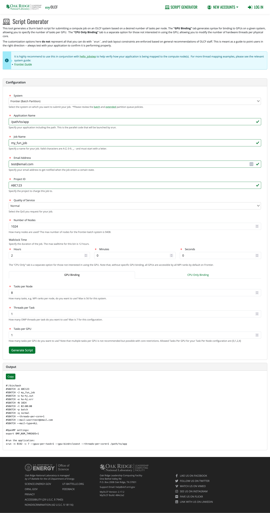

# Welcome to Hands-on New User training (Subil)
 
This training is designed to introduce you to the Oak Ridge Leadership Computing Facility and its resources. Also you should never be more than 20 minutes away from and hands-on exercise. For this training you will want to have a browser window open and an ssh terminal open.

 
## Resources Overview (Subil)
 
We'll begin with an overview of Frontier, our exascale super computer.
 
Since it is easiest to do this from pictures, lets go to the Frontier docs:
https://docs.olcf.ornl.gov/systems/frontier_user_guide.html#system-overview


 
You can also watch [this video giving a more detailed overview of the Frontier hardware](https://vimeo.com/840551316).

 
## Hands-on Finding Jupyter terminal (Tony)
If you do not have an ssh terminal:
1. Open and tab on your browser and direct it to https://docs.olcf.ornl.gov/services_and_applications/jupyter/overview.html#access.
2. Then follow the directions there to access the moderate Jupyter hub if you are a Frontier user. IF you are using Odo or Ascent follow the directions for the Open Jupyter hub. In either case, choose one of the CPU labs.
3. Once you are in, find the "terminal icon". Now you will be ready to do the first hands-on.
 
There are many more uses for OLCF Jupyter Hub and you can find them in the Jupyter at OLCF guide. https://docs.olcf.ornl.gov/services_and_applications/jupyter/overview.html
 
## How to login to Frontier (Tony)
 
Once you have a terminal open (either through Jupyter or by opening a terminal program on your computer), You can login to frontier by executing the following command
 
```
$ ssh <your username>@frontier.olcf.ornl.gov
```
 
Replace `<your username>` with your actual username.
 
If you are using Odo, execute the following instead
 
```
$ ssh <your username>@odo.olcf.ornl.gov
```
 
After you press enter, you will be asked to enter your PASSCODE
 
```
$ ssh <your username>@frontier.olcf.ornl.gov
Enter PASSCODE:
```
 
Type in your PIN followed by the six digits shown on your RSA token in one continuous sequence (no spaces). You will not see anything being typed on screen, THIS IS NORMAL. SSH does give you any visual feedback when typing your PASSCODE, but it is still receiving your key presses. Just type the full PASSCODE on your keyboard normally and press enter.
 
If this is your first time ever logging in and you've not set your PIN before, follow the steps in [Activating a New SecurID Fob in the docs](https://docs.olcf.ornl.gov/connecting/index.html#activating-a-new-securid-fob).
 
If your SSH operation succeeds, you should be placed in your home directory on Frontier or Odo
 
```
[subil@login05 ~]$ pwd
/ccs/home/subil
```

## Clone the NewUserQuickStart repository

Parts of this new user training will have hands on portions. So clone this repository into your home
directory with

```
git clone https://github.com/olcf/NewUserQuickStart
```

And navigate to the Frontier directory
```
cd NewUserQuickStart
cd Frontier
```
 
## Authentication with RSA tokens (Tony)
 
In an earlier section, we covered logging into Frontier or Odo using SSH and with your RSA token. Let's talk a bit more about what we're doing here.
 
We are using 2-factor authentication via user-selected PINs and RSA securID token. The numbers on the RSA securID token change every 30 seconds. Entering your PIN+tokencode is the only login method available. Using other methods (password, public key, etc) are not allowed.
 
### RSA terminology
* tokencode - the 6 digit number on your RSA token
* PIN - an alphanumeric string of 4-8 characters known only to you
* PASSCODE - your PIN followed by the current tokencode without any spaces
 
### Common Login Issues
 
SSH will not prompt you for your username, so make sure that when you SSH you are using the full `ssh <your username>@frontier.olcf.ornl.gov`.
 
Your RSA token might get out of sync with the server. So sometimes you might be prompted for 'next tokencode'
```
Enter PASSCODE:
Wait for the tokencode to change, then enter the new tokencode :
```
When this happens, enter only the tokencode your RSA token generates. Don't enter the PIN. In general, when it asks for PASSCODE, enter the PIN+tokencode. For any other case, the terminal will explicitly tell you what it wants you to do.
 
Sometimes you might encounter a message that looks like "Connection closed by <ip address>" after you correctly enter your PASSCODE. This usually indicates that your account no longer has access to the particular system you are trying to SSH to. Your account's access to systems is tied to your project. So when your project's access to a system expires, you lose access to that system.
 
 
If your PASSCODE has failed twice i.e. you are being prompted to enter your PASSCODE for the third time in a row, let the tokencode change before you try entering your PASSCODE again (to avoid getting locked out).
 
If you find that you keep entering the PASSCODE correctly but it fails to log you in, its possible you may have been locked out. Send an email to help@olcf.ornl.gov with the information on what you are seeing. If your account is locked, the OLCF Help Desk can unlock it for you.

 
## User Guides Overview (Subil)
OLCF has users guides for its compute systems, data management tools and polices. They have examples that cover the basics that you need to know to run on our system. Let's start with a hands-on to help you find and navigate those guides.

### User Guide Hands-on
Open a browser tab and go to https://docs.olcf.ornl.gov. 
Select the "Systems" option in the left menu bar. 

1.	Open Andes guide: Raise your virtual hand when it is open. 

2.	Name one visualization tool available on Andes. 

3.	What Andes batch queue has the longest available run time? 

Close the Andes system guide on the left and open the Frontier user guide. 
Raise your virtual hand when it is open. 

1.	Name one profiling application available on Frontier that is described in the guide. 

2.	Find the Thread Mapping examples in the running jobs section; What is the `srun` command that ensures that the MPI tasks will be distributed across sockets in a cyclic (round-robin) manner? 

3.	Find the Tips and Tricks section; Read the name of one tip listed in that section. 

4.	Find the Known Issue section. Raise your virtual hand when you find it. 

Close the Frontier guide and open the Software guide. 

1.	Find the ML/AI guide on Frontier 

2.	Find Installing Pytorch on Frontier 

3.	Find the Containers on Frontier section 
 
 
### Hands-on User Guide Cipher
 
This exercise is designed to help you understand which user guides are available and how to navigate to them. Book ciphers use numbers or instructions representing the positions of words in a text to navigate to words that form secret messages.
 
For example, if you were given (9,10,6,7,8) and pointed at the paragraph above, you could form a sentence by finding the 9th, 10th, 6th 7th and 8th word in that text.
 
You will use the section headings in the left menu bar of the OLCF Userguide at https://docs.olcf.ornl.gov plus the text counting clues given below each to navigate to words that allow you to decipher a tip that is helpful for new users.
 
Here are the rules:
 
1.  Count a sentence and its associated list of bullets or steps as one paragraph.
 
2.  Count hyphenated words as one word.
 
3.  Do not count bullets or list numbers when counting words.
 
Key: https://docs.olcf.ornl.gov, Look to the left menu bar. GO!
 
1. Systems> Frontier User Guide> Running Jobs> Batch Scripts;
    First word in the third paragraph.
 
2.  Systems> Frontier User Guide> Running Jobs> Process and Thread Mapping Examples;
    Tenth word in the second paragraph.
 
3.  Systems > Andes User guide>Running Jobs;
    Third paragraph, 4th step, fifth word.
 
4.  Data Storage and Transfers Guide > Alpine2 IBM Spectrum Scale Filesystem;
    First paragraph, third sentence. Look for the first comma in that sentence, grab the first word after that comma.
 
5. Data Storage and Transfers Guide > Summary of Storage Areas;
    Green “!Tip”Box, First sentence 10th word.
 
 
When you are done, raise your virtual hand.
 

## Storage at OLCF (Subil)

<br>
<center>

</center>
<br>


OLCF has a Network Files system (NFS) that you land on when you login. This is a small secure filesystem that is provisioned to hold your most important data. This is the best place for your executables and small important data. It is backed up. 

OLCF also has a large parallel filesystem, Orion Lustre, for Frontier that you should use to hold your large production data for simulation campaigns while you are running. Orion is not backed up and data older than 90 days are purged. 

OLCF storage systems have different areas designated for induvial user storage and project level storage that is controlled by the file permissions. Please make sure that data that is to be shared with multiple project members in in the project storage. This especially important as people leave your project. 

For details see our [Data Storage and Transfers Guide]( https://docs.olcf.ornl.gov/data/index.html).

Longer term storge is available in OLCF’s nearline storge system called Kronos. Kronos is mounted on the moderate security enclave Data Transfer Nodes (dtn.ccs.ornl.gov) and is accessible via Globus at the “OLCF Kronos” collection. Standard UNIX commands and tools can also be used to interact with Kronos (scp, rsync, etc.). 

See the Kronos section of our [Data Storage and Transfers guide](https://docs.olcf.ornl.gov/data/index.html#kronos-nearline-archival-storage-system)

## Hands-on Find Your Storage Areas (Subil) 

Login to Frontier and go to your individual  user storage called “scratch”: 

Frontier (Orion) : 

```
cd /lustre/orion/[projid]/scratch/[userid]
ls
```

You can also do:

```
cd $MEMBERWORK/[projid]
ls
```

Now let’s look at the project level storage, proj-shared:

```
cd /lustre/orion/[projid]/proj-shared/
ls

```

You can also do:
```
cd $PROJWORK/[projid]/
ls
```

And for sharing between projects:
```
cd /lustre/orion/[projid]/world-shared/
ls
```

You can also do:
```
cd $WORLDWORK/[projid]
ls
```
 

 
## Finding and Building Software (Tony)


Documentation on modules and compilers: https://docs.olcf.ornl.gov/systems/frontier_user_guide.html#programming-environment
 
(the following section applies to Odo as well, so you can follow along if you're on Odo)
 
Frontier supports a large number of users from a wide range of scientific disciplines. Different users have different software needs. Some users might need to use different versions of the same software. In order to accommodate this, Frontier uses Lmod. Lmod manages software installed on Frontier in the form of 'modules'. You can get access to a specific software or package or library you need by 'loading' the specific module (provided it is available on Frontier).
 
 
For example, if you want to use the `hipcc` compiler which is part of AMD's ROCm software stack, you need to first load the `rocm` module. The command is the same as what you did earlier to load miniforge
 
```
$ hipcc --version
If 'hipcc' is not a typo you can use command-not-found to lookup the package that contains it, like this:
    cnf hipcc
$ module load rocm
$ hipcc --version
HIP version: 6.2.41134-65d174c3e
AMD clang version 18.0.0git (https://github.com/RadeonOpenCompute/llvm-project roc-6.2.4 24392 1e2c94795ee0d6ab8e2ff3035965a6b74e11b475)
Target: x86_64-unknown-linux-gnu
Thread model: posix
InstalledDir: /opt/rocm-6.2.4/lib/llvm/bin
Configuration file: /opt/rocm-6.2.4/lib/llvm/bin/clang++.cfg
```
 
If you want to use a specific version of the ROCm software stack, you can check which versions are available by running `module spider rocm`. (Note: module spider output will show 
colors when you actually use it on the terminal).
 
```
$ module spider rocm
----------------------------------------------------------------------------------------------------------------------------------------------------------------------------------------------------
(OLCF SPIDER): Modules in RED are not supported by ORNL!    (for non-colorized output, set LMOD_COLORIZE=0)
  To learn more about unsupported modules see: https://docs.olcf.ornl.gov/software/UMS/index.html
----------------------------------------------------------------------------------------------------------------------------------------------------------------------------------------------------
----------------------------------------------------------------------------------------------------------------------------------------------------------------------------------------------------
  rocm:
----------------------------------------------------------------------------------------------------------------------------------------------------------------------------------------------------
    Versions:
      rocm/5.3.0
      rocm/5.4.0
      rocm/5.4.3
      rocm/5.5.1
      rocm/5.6.0
      rocm/5.7.0
      rocm/5.7.1
      rocm/6.0.0
      rocm/6.1.3
      rocm/6.2.0
      rocm/6.2.4
      rocm/6.3.1

----------------------------------------------------------------------------------------------------------------------------------------------------------------------------------------------------
For detailed information about a specific module use the module's full name.
For example:

    $ module spider Foo/1.2.3
----------------------------------------------------------------------------------------------------------------------------------------------------------------------------------------------------
 
 
```
You can see the full list of modules available to load by simply executing `module spider` without a module name given.
 
```
$ module spider
----------------------------------------------------------------------------------------------------------------------------------------------------------------------------------------------------
(OLCF SPIDER): Modules in RED are not supported by ORNL!    (for non-colorized output, set LMOD_COLORIZE=0)
  To learn more about unsupported modules see: https://docs.olcf.ornl.gov/software/UMS/index.html
----------------------------------------------------------------------------------------------------------------------------------------------------------------------------------------------------
  .qt: .qt/5.15

  Core: Core/24.00 Core/24.07

  DefApps: DefApps

  DefApps-spi: DefApps-spi

  PrgEnv-amd: PrgEnv-amd/8.3.3 PrgEnv-amd/8.4.0 PrgEnv-amd/8.5.0 PrgEnv-amd/8.5.0 PrgEnv-amd/8.6.0

  PrgEnv-cray: PrgEnv-cray/8.3.3 PrgEnv-cray/8.4.0 PrgEnv-cray/8.5.0 PrgEnv-cray/8.6.0

  PrgEnv-cray-amd: PrgEnv-cray-amd/8.3.3 PrgEnv-cray-amd/8.4.0 PrgEnv-cray-amd/8.5.0 PrgEnv-cray-amd/8.6.0

  PrgEnv-gnu: PrgEnv-gnu/8.3.3 PrgEnv-gnu/8.4.0 PrgEnv-gnu/8.5.0 PrgEnv-gnu/8.5.0 PrgEnv-gnu/8.6.0
 
<truncated for space>
```
 
And you can load a specific version of a module like rocm 6.0.0 specifying the version number in the `module load` command like so:
 
```
$ module load rocm/6.0.0
```
 
If a specific version number is not specified, it will load a system defined default version (in the case of rocm, the default version loaded is 6.2.4).
 
 
`module load` does a few things, chief among which is it updates some environment variables that the OS uses to look for software or libraries. You can see information about a module and a summary of what changes are made when you execute a `module show` operation.
 
```
$ module show rocm
------------------------------------------------------------------------------------------------------------------------------------------------------------------------------------------------
   /opt/cray/pe/lmod/modulefiles/core/rocm/6.2.4.lua:
------------------------------------------------------------------------------------------------------------------------------------------------------------------------------------------------
unsetenv("CRAY_LMOD_AMD_CONTROL_TK_LOAD")
help([[6.2.4
/opt/rocm-6.2.4
This modulefile defines the system paths and environment
variables needed to use the ROCm Toolkit. The ROCm modulefile
enables ROC Profiler, ROC Tracer, HIP, and ROCr.

This module is required to interface with AMD accelerators for
all programming environments.

To use CPE's AMD environment with amd libraries, load the amd
modulefile. The core "amd" compiler modulefile is required if access
to AMD compatible libraries is necessary.

Mixed compiler modules (such as amd-mixed) do not extend the CPE Lmod
hierarchy and can be loaded with core compilers (such as cce).

===================================================================
To see AMD/6.2.4 release information,
  visit https://rocmdocs.amd.com/en/latest
===================================================================

To make this the default version, execute:
/opt/admin-pe/set_default_craypkg/set_default_rocm_6.2.4

Certain components, files or programs contained within this package or
product are Copyright 2021-2023 Hewlett Packard Enterprise Development LP.

]])
whatis("Defines the system paths and environment variables required for the ROCm Toolkit.")
setenv("CRAY_ROCM_DIR","/opt/rocm-6.2.4")
setenv("CRAY_ROCM_PREFIX","/opt/rocm-6.2.4")
setenv("CRAY_ROCM_VERSION","6.2.4")
setenv("ROCM_PATH","/opt/rocm-6.2.4")
setenv("HIP_LIB_PATH","/opt/rocm-6.2.4/lib")
prepend_path("PATH","/opt/rocm-6.2.4/bin")
prepend_path("MANPATH","/opt/rocm-6.2.4/share/man")
prepend_path("CMAKE_PREFIX_PATH","/opt/rocm-6.2.4/lib/cmake/hip")
setenv("CRAY_ROCM_INCLUDE_OPTS","-I/opt/rocm-6.2.4/include -I/opt/rocm-6.2.4/include/rocprofiler -I/opt/rocm-6.2.4/include/roctracer -I/opt/rocm-6.2.4/include/hip -D__HIP_PLATFORM_AMD__")
setenv("CRAY_ROCM_POST_LINK_OPTS"," -L/opt/rocm-6.2.4/lib -L/opt/rocm-6.2.4/lib/rocprofiler -L/opt/rocm-6.2.4/lib/roctracer -lamdhip64")
prepend_path("LD_LIBRARY_PATH","/opt/rocm-6.2.4/lib")
prepend_path("LD_LIBRARY_PATH","/opt/rocm-6.2.4/lib/rocprofiler")
prepend_path("LD_LIBRARY_PATH","/opt/rocm-6.2.4/lib/roctracer")
append_path("PE_PRODUCT_LIST","CRAY_ROCM")
prepend_path("PKG_CONFIG_PATH","/usr/lib64/pkgconfig")
prepend_path("PE_PKGCONFIG_LIBS","rocm-6.2.4")
```
 
 
At anytime you can check the modules that are currently loaded by running `module list`
 
```
$ module list
 
Currently Loaded Modules:
  1) craype-x86-trento    4) perftools-base/24.11.0           7) cce/18.0.1        10) cray-mpich/8.1.31    13) Core/24.07                 16) hsi/default        19) rocm/6.2.4
  2) libfabric/1.22.0     5) xpmem/2.10.6-1.2_gfaa90a94be64   8) craype/2.7.33     11) cray-libsci/24.11.0  14) tmux/3.4                   17) lfs-wrapper/0.0.1
  3) craype-network-ofi   6) cray-pmi/6.1.15                  9) cray-dsmml/0.3.0  12) PrgEnv-cray/8.6.0    15) darshan-runtime/3.4.6-mpi  18) DefApps

```
 
Now it might seem strange there are a number of modules in the list in addition to the `rocm` module you loaded. This is because Frontier loads a default set of modules every time you log in. You will also notice that a number of these default modules start with `cray`. Frontier is an HPE Cray system, and so several software libraries are provided by the Cray software team that are optimized for use on Frontier.
 
One of the modules in the above list is `PrgEnv-cray`. This means that the Cray Programming Environment. A Programming Environment is a collection of libraries along with a compiler that are all loaded together. `PrgEnv-cray` loads the Cray Compiling Environment which is the set of C, C++, and Fortran compilers along with libraries compiled with those compilers. When this programming environment is loaded, the Cray compilers are available for use. Also available are PrgEnv-gnu and PrgEnv-amd, which loads the GNU and AMD compilers respectively, along with reloading any libraries to load the libraries compiled with the currently loaded compiler.
 
For example, if you load PrgEnv-gnu, you will see the following output.
 
```
$ module load PrgEnv-gnu
Lmod is automatically replacing "cce/18.0.1" with "gcc-native/13.2".


Lmod is automatically replacing "PrgEnv-cray/8.6.0" with "PrgEnv-gnu/8.6.0".


Due to MODULEPATH changes, the following have been reloaded:
  1) cray-libsci/24.11.0     2) cray-mpich/8.1.31     3) darshan-runtime/3.4.6-mpi
```
 
Here's a list of the useful commands we've seen so far:
`module load` - load a module so that it becomes available to use
`module show` - show more information about a particular module
`module list` - show list of currently loaded modules
`module spider` - show list of modules and their versions, or if a module name is specified, show the versions of those modules that are available to load
 
### Building software:
 
To compile your C, C++, or Fortran code, you will not invoke the compiler command directly but instead you will invoke the Cray provided compiler wrappers.
 
For example, say you had PrgEnv-gnu loaded because you wanted to use the `gcc` compiler. Instead of using the `gcc` command directly, you will use the compiler wrapper command `cc`.
 
```
$ cc -o hello hello.c
```
 
For C code, you will use the `cc` compiler wrapper. For C++, you will use the `CC` compiler wrapper. And for Fortran you will use `ftn`. This applies for any programming environment you may be using.  The compiler wrapper automatically includes the necessary header files and libraries needed for MPI so you don't have to explicitly link the MPI libraries. There are nuances to this that aren't covered here, such as when you're compiling for both MPI and GPU functionality. See more information about compiling in [the Frontier documentation](https://docs.olcf.ornl.gov/systems/frontier_user_guide.html#compiling).
 
You can run `cc -craype-verbose` to get a full picture of what the compiler wrapper is doing when compiling.

## Building And Using Containers (Subil)

Containers are a tool to package up your application along with its dependencies into a single
artifact. This artifact can be run just like any other application on an HPC system. Your packaged
application will not depend on the presence of libraries on the host since they all are packaged
with the application in the container. This also makes it easier to distribute the application to
team members and collaborators (provided they are working on the same system or using the same
CPU+GPU architecture if they're on a different system).

On Frontier, we provide Apptainer to build containers and also to run the containers you build. We
will focus on a simple Frontier specific example. For a basic rundown on how to write an Apptainer
.def file that will be used to build a container, see here: https://apptainer.org/docs/user/1.3/quick_start.html#apptainer-definition-files

The OLCF documentation has more detailed examples on using Apptainer on Frontier: https://docs.olcf.ornl.gov/software/containers_on_frontier.html

We will look at the LAMMPS example from the
[olcf_container_examples](https://github.com/olcf/olcf_containers_examples) repository:
https://github.com/olcf/olcf_containers_examples/tree/main/frontier/containers_on_frontier_docs/apptainer_wrappers_lammps/gpu
. This example is covered in the [Containers on Frontier
docs](https://docs.olcf.ornl.gov/software/containers_on_frontier.html#apptainer-modules).


OLCF provides several prebuilt base container images that you can use as a starting point. You can
see the list in [this
table](https://docs.olcf.ornl.gov/software/containers_on_frontier.html#olcf-base-images-apptainer-modules).

Create a file named `lammps.def` with the following content:
```
Bootstrap: docker
From: savannah.ornl.gov/olcf-container-images/cpe:24.11_gnu_opensuse

%post
    wget https://github.com/lammps/lammps/archive/refs/tags/stable_2Aug2023_update3.tar.gz
    tar xzf stable_2Aug2023_update3.tar.gz
    zypper install -y cmake
    cmake -S lammps-stable_2Aug2023_update3/cmake -B lammps_build -D CMAKE_INSTALL_PREFIX=/opt/lammps -D CMAKE_CXX_COMPILER=hipcc \
                -D PKG_KOKKOS=yes -D Kokkos_ARCH_HOSTARCH=yes -D Kokkos_ARCH_GPUARCH=yes -D Kokkos_ENABLE_HIP=yes
    cmake --build lammps_build --target install -j8
    rm -r stable_2Aug2023_update3.tar.gz lammps-stable_2Aug2023_update3 lammps_build

%environment
    export PATH="/opt/lammps/bin:$PATH"
```

Build the container image by running the command
```
apptainer build lammps.sif lammps.def
```


## Submitting and Running Jobs with Slurm (Subil)

Documentation: https://docs.olcf.ornl.gov/systems/frontier_user_guide.html#running-jobs

Here is a simple job script named `submit.sl`

```
#!/bin/bash
#SBATCH -A STF007
#SBATCH -J RunSim123
#SBATCH -o %x-%j.out
#SBATCH -t 0:10:00
#SBATCH -p batch
#SBATCH -N 1

srun -N1 --tasks-per-node=8 --gpus-per-task=1 --gpu-bind=closest ./hello
```

Submitting a job that uses container requires loading an additional module, but is mostly similar to
submitting a regular job otherwise.

Here's a job script that runs LAMMPS from the LAMMPS container you built in the last section.

``` 
#!/usr/bin/env bash

#SBATCH -A STF007 
#SBATCH -J lammps_container
#SBATCH -o %j.out
#SBATCH -N 2
#SBATCH -t 00:20:00

module reset
module load PrgEnv-gnu
module load olcf-container-tools
module load apptainer-enable-mpi apptainer-enable-gpu

srun -N 2 -n 16 --gpus-per-task=1 --gpu-bind=closest --unbuffered  apptainer exec lammps.sif lmp -k on g 1 -sf kk -pk kokkos gpu/aware on -in /lustre/orion/stf007/world-shared/ij.in
```

## Job Script Generator in myOLCF (Tony) 

You can find the OLCF Job Script Generator here: 

https://my.olcf.ornl.gov/script-generator

Or from the home page at https://my.olcf.ornl.gov/ at the top-right of the screen. It is not necessary to log in or have an OLCF account.

You can use the generator to make submission scripts for your jobs on Frontier using OLCF recommended configurations

It's a step-by-step process you can fill out like such:



After your script is generated, you can simply click "Copy" on the output and paste it into your `sbatch` script.  

### Job Step Viewer
The Job Step Viewer tool from Summit is back in development for Frontier, and is coming soon for your layout visualization needs!

With Job Script Generator and Job Step Viewer you can look at how recommended layouts get placed on Frontier.

## Srun and hello_jobstep

A proper job layout is crucial for optimal performance on Frontier. This section demonstrates how to verify your job layout using a thread-mapping tool called `hello_jobstep`.


### Clone and Compile `hello_jobstep`

Clone the repository and follow the compilation instructions in the [hello_jobstep repo](https://code.ornl.gov/olcf/hello_jobstep).

To do  that:

```
git clone https://code.ornl.gov/olcf/hello_jobstep.git


cd hello_jobstep
```

You can use this program to check your job's layout on a single node before running at scale. 

### Understanding GPU Affinity on Frontier

The Frontier documentation has a detailed section covering the options you can use with srun to control your job.

For this hands-on exercise we will focus on the GPU affinity because it is a feature specific to frontier. 

Before running the job, review the Frontier node diagram [here in the documentation](https://docs.olcf.ornl.gov/systems/frontier_user_guide.html#frontier-compute-nodes). It shows how L3 cache regions and CPU cores are linked to specific GPUs.

For instance, hardware threads 0–9 belong to the L3 region most closely connected to GPU 4.


Two common approaches for assigning MPI ranks:

- **Round-robin (`-m block:cyclic`)**: Distributes tasks in packed blocks across nodes and assigns them in a cyclic manner across L3 caches.
- **Packed (`-m block:block`)**: Distributes tasks in packed blocks across nodes and keeps them in packed blocks within L3 caches.

We will examine the `-m block:block` case because it demonstrates how the default layout may assign tasks to L3 regions and GPUs that are farther apart than optimal, potentially reducing node performance.

Request an interactive job for 15 minutes:

```
salloc -A <project_id> -t 15 -p batch -N 1

cd hello_jobstep
```
Submit the following job: 

```
OMP_NUM_THREADS=1 srun -N1 -n8 -c1 -m block:block --ntasks-per-gpu=1 ./hello_jobstep | sort
``` 

Here is what the options mean: 


| Option              | Description                                                |
|---------------------|------------------------------------------------------------|
| `-N 1`              | Use **1 node**                                             |
| `-n 8`              | Launch **8 MPI tasks**                                     |
| `-c 1`              | Assign **1 logical core per MPI task**                     |
| `-m block:block`    | Distribute tasks in a **block layout across nodes and L3 caches** |
| `--ntasks-per-gpu=1` | Ensure **one task per GPU**                                |


When the job has finished open the output file and the [Frontier node diagram](https://docs.olcf.ornl.gov/systems/frontier_user_guide.html#low-noise-mode-layout)

Note which GPUs are used with which hardware thread. 

*Example Output:*

```
OMP_NUM_THREADS=1 srun -N1 -n8 -c1 -m block:block --ntasks-per-gpu=1 ./hello_jobstep | sort
MPI 000 - OMP 000 - HWT 001 - Node frontier05586 - RT_GPU_ID 0 - GPU_ID 4 - Bus_ID d1
MPI 001 - OMP 000 - HWT 002 - Node frontier05586 - RT_GPU_ID 0 - GPU_ID 0 - Bus_ID c1
MPI 002 - OMP 000 - HWT 003 - Node frontier05586 - RT_GPU_ID 0 - GPU_ID 1 - Bus_ID c6
MPI 003 - OMP 000 - HWT 004 - Node frontier05586 - RT_GPU_ID 0 - GPU_ID 2 - Bus_ID c9
MPI 004 - OMP 000 - HWT 005 - Node frontier05586 - RT_GPU_ID 0 - GPU_ID 3 - Bus_ID ce
MPI 005 - OMP 000 - HWT 006 - Node frontier05586 - RT_GPU_ID 0 - GPU_ID 5 - Bus_ID d6
MPI 006 - OMP 000 - HWT 007 - Node frontier05586 - RT_GPU_ID 0 - GPU_ID 6 - Bus_ID d9
MPI 007 - OMP 000 - HWT 009 - Node frontier05586 - RT_GPU_ID 0 - GPU_ID 7 - Bus_ID de
```

Observe how hardware threads (HWT) are mapped to GPUs (GPU_ID). In some cases, tasks are assigned to GPUs that are farther from their L3 region than ideal, which can degrade performance.

### Using `--gpu-bind=closest` for Optimal Affinity

The `--gpu-bind=closest` flag will ensure that the job binds the hardware threads to the GPU that is most closely connected to their L3 cache.

Run the job again with `--gpu-bind=closest`.

```
OMP_NUM_THREADS=1 srun -N1 -n8 -c1 -m block:block --ntasks-per-gpu=1 --gpu-bind=closest ./hello_jobstep | sort

```
Look at the output and the [Frontier Node Diagram](https://docs.olcf.ornl.gov/systems/frontier_user_guide.html#low-noise-mode-layout)
to convince yourself that the hardware threads are now bound to the GPU closest to their L3 cheche religion.


For more information about how to control the job layout, see out in depth video tutorial (From February 2024 New User Training): [recording](https://vimeo.com/918365102?share=copy) (skip to 2:27:00 mark), [slides](https://www.olcf.ornl.gov/wp-content/uploads/9.-Slurm-on-Frontier_Hagerty.pdf)

## Python at OLCF (Tony)  

In high-performance computing, Python plays a vital role in analyzing scientific data. OLCF provides a [Python on OLCF Systems guide](https://docs.olcf.ornl.gov/software/python/index.html#python-on-olcf-systems) within the Software Guide. This guide explains how to load the latest Python versions, manage your environment, and run Python on Frontier and Andes.

## Goals

- Create a new virtual environment using conda.
- Install `mpi4py` from source.
- Test the build with a Python script.
- Understand tips for running parallel python jobs on Frontier

### Base Environment

Loading a module sets up a base Python environment on each system. Note that custom packages like `numpy` and `scipy` are typically not included in the base environment. For this exercise, refer to the ["Python on OLCF Systems" guide](https://docs.olcf.ornl.gov/software/python/index.html#python-on-olcf-systems).

### Hands-on List the Packages in the Base Environment 

1. Visit the [Python on OLCF Systems Base Environments](https://docs.olcf.ornl.gov/software/python/index.html#base-environment) page in the Software Guide.
2. Navigate to `docs.olcf.ornl.gov` > **Software** > **Python on OLCF Systems Base Environments**.
3. Select the tab for the resource you are using.
4. Follow the instructions to list the available packages.
5. If you are using Odo, follow the Frontier-specific instructions.

For example, on Frontier/Odo you would run:

```bash
module load miniforge3/23.11.0
conda list
```
### Setting up a Custom Environment

Suppose you want to install the numpy package. Installing packages in your base environment can lead to conflicts as you add more packages. It is best practice to set up a custom environment that contains consistent versions of all the packages you use for each project.

### Best Practices for Custom Conda Environments

Both Frontier and Andes mount the home and project areas, an environment built for one machine cannot be assumed to work seamlessly on the other, so it is important to have an organization structure for your python environments from the start.

Best Practices: 

- **Store in Project Areas:** Place your custom conda environments in your user project areas on NFS. This prevents them from being purged and makes them shareable with your project team.
- **Identify by Machine:** Include the machine name in the environment name or store environments in a directory named for that machine.
- **Keep It Organized:** Save your conda environments in a `.conda` folder to clearly identify them and avoid cluttering your directory listings.
- **Use Source Activate:** ALWAYS use `Source Activate` even when Python prompts  you to use `conda activate`. NEVER user `conda activate` on OLCF machines. `conda activate` can put options in your configuration files, which are shared between all the machines, but those options will not work universally on all the machines you use. 


For your future reference, open a new browser tab or window and direct it to [https://docs.olcf.ornl.gov/software/python/index.html#custom-environments](https://docs.olcf.ornl.gov/software/python/index.html#base-environment). You will see tabs under "To create and activate an environment:" that have instructions for creating custom environments on each of our resources.

### Custom Python Environment Hands-on

This hands-on exercise will walk you through setting up a custom environment that we will use later in the training. We will create a custom environment called *mpi4py_env* in your /ccs/proj/<<your_project_id>>. If you are on Odo, you will use /ccsopen/proj/<<your_project_id>>.

Most Python packages assume GCC, so we will load the the gnu compiler module. 

```bash
$ module load PrgEnv-gnu
$ module load miniforge3
```
Use `conda create` to make the *mpi4py_env* following the Python Best Practices.

```
$ conda create -p /ccs/proj/<your_project_id>/<your_user_id>/.conda/frontier/mpi4py_env python=3.10.13
```

The "-p" flag specifies the desired path and name of your new virtual environment. The directory structure is case sensitive, so be sure to insert "<your_project_id>" ad as lowercase. Directories will be created if they do not exist already (provided you have write-access in that location).


After following the prompts for creating your new environment, the installation should be successful, and you will see something similar to:

```
Preparing transaction: done
Verifying transaction: done
Executing transaction: done
#
# To activate this environment, use
#
#     $ conda activate /ccs/proj/<<your_project_id>>/<<your_user_id>>/.conda/frontier/mpi4py_env
#
# To deactivate an active environment, use
#
#     $ conda deactivate
```
Due to the specific nature of conda on Frontier, we will be using `source activate` instead of `conda activate` to activate our new environment:

```bash
$ source activate /ccs/proj/<<your_project_id>>/<<your_user_id>>/.conda/frontier/mpi4py_env
```

The path to the environment should now be displayed in "( )" at the beginning of your terminal lines, which indicate that you are currently using that specific conda environment.
If you check with `conda env list`, you should see that the `*` marker is next to your new environment, which means that it is currently active:

```bash
$ conda env list

# conda environments:
#
base              ≈       /autofs/nccs-svm1_sw/frontier/miniforge3/23.11.0
                      *  /ccs/proj/<<your_project_id>>/<<your_user_id>>/.conda/frontier/mpi4py_env
```


## Installing mpi4py

Now that we have a fresh conda environment, we will next install mpi4py from source into our new environment.
To make sure that we are building from source, and not a pre-compiled binary, we will be using pip:

```bash
$ MPICC="cc -shared" pip install --no-cache-dir --no-binary=mpi4py mpi4py
```

* The `MPICC` flag ensures that you are using the correct C wrapper for MPI on the system.
* -shared tells the compiler to produce a shared object (dynamic library) instead of an executable.
* --no-cache-dir: Prevents pip from using or storing cached packages, forcing a fresh download and build.
* --no-binary=mpi4py: Ensures that mpi4py is built from source instead of using a pre-compiled binary. This is important for compatibility with the specific MPI implementation on the system.

Building from source typically takes longer than a simple `conda install`, so the download and installation may take a couple minutes.
If everything goes well, you should see a "Successfully installed mpi4py" message.

## Running with Python 

To test the mpi4py we just installed in the exercise above, we will use an example Python script called "hello_mpi.py".

To do so, we will be submitting a job to the batch queue with "submit_hello.sbatch":

This part of the hands-on covers the [How to Run](https://docs.olcf.ornl.gov/software/python/index.html#how-to-run) section of the Python on OLCF system Guide. 

The example below is for Frontier, but if you are using Andes or Odo you can use the guide linked above to understand how to adjust the commands accordingly. 


To get to this script 

```
cd python_hands-on
```

On Frontier Odo, and Andes, you're already on a compute node once inside a batch job.

Use srun only for parallel-enabled Python; don't use it for serial applications.
 
$PATH issues can occur if submitting from a non-fresh login shell, leading to the wrong environment being detected.
 To prevent this:
 * Use --export=NONE when submitting a job.
 * Unset SLURM_EXPORT_ENV in your job script before calling srun.
 * Load modules and activate your environment inside the batch script.

An example batch script for this is provided below:

```
#!/bin/bash
#SBATCH -A <your_project_id_here>
#SBATCH -J mpi4py
#SBATCH -o %x-%j.out
#SBATCH -t 0:10:00
#SBATCH -p batch
#SBATCH -N 1

unset SLURM_EXPORT_ENV

date

module load PrgEnv-gnu
module load miniforge3

# TODO: build your own environment with mpi4py using the instructions above!
# source activate /ccs/proj/<<your_project_id>>/<<your_user_id>>/.conda/frontier/mpi4py_env
source activate /lustre/orion/stf007/world-shared/new-user-training/mpi4py_env

srun -n42 python3 -u hello_mpi.py
```

The srun in this example has`-n42`, which means launch 42 MPI tasks per node. 

Use the example script as a guide to edit the batch script for our exercise.

Open the submit_hello.sbatch 
```
vi submit_hello.sbatch 

```
* Edit the second line after `-A` to your project ID
* Note the `unset SLURM_EXPORT_ENV` line 
* Note the lines that reload modules
* Edit the source activate line to activate the mpi4p_env we created together. 
* close and save the file. 

To submit the batch script from a fresh shell: 

```
sbatch --export=NONE submit_hello.sbatch
```

Once the batch job makes its way through the queue, it will run the "hello_mpi.py" script with 42 MPI tasks.
If mpi4py is working properly, in `mpi4py-<JOB_ID>.out` you should see output similar to:

```
Hello from MPI rank 21 !
Hello from MPI rank 23 !
Hello from MPI rank 28 !
Hello from MPI rank 40 !
Hello from MPI rank 0 !
Hello from MPI rank 1 !
Hello from MPI rank 32 !
```
Congratulations! You have the tools and knowledge you need to start using python on Frontier! 


## Globus (Subil)
 
* Globus is a fast and reliable way to move files between OLCF systems and between OLCF and other institutions.
* It has a convenient Web-interface at globus.org that you log into with a username and password.
* Transfers are done by activating “Collections” which are portals into the OLCF's file systems and to those of participating institutions.
* Globus is the recommended way to move files between OLCF systems and between OLCF and exterior systems.
 
For this exercise we will setup your globus.org username and password. You can skip this if you have a globus ID.

Note: Globus is not controlled by OLCF and its help and login pages and option change without warning. This hands-on is based on Globus pages from 05-02-24. Even if the specific Globus pages change, this tutorial should be close to what is needed to get a globus username and password.
 
### Hands-on GlobusID
 
1. Open a browser and direct it to globusid.org.
2. Select "create GlobusID" and follow the instructions
3. Remember your globusID and password someplace safe.
 
Now try to log in: 

1. Go to globus.org and click "Login"
  
2.  Find the "use Globus ID" link and use your GlobusID to login.  The Oak Ridge National Laboratory login is only for ORNL staff.
3. You should see the Globus "File Manager" when you are logged in.
 
### Activating a Globus Collection
 
Activating the OLCF Globus Collection is done using your OLCF username and Token Passcode. Think of it as logging in to an OLCF filesystem.

Collections stay activated for three days, so you don’t need to enter your credentials for each transfer, and you can run a transfer workflow during a simulation.
  
The OLCF Moderate Collection is called “OLCF DTN (Globus 5)”. 

If you are on Odo, you are in the OLCF Open enclave, and its Collection is called "NCCS Open DTN (Globus 5)". It is a portal to the open NFS and GPFS filesystems.
 
The following exercise assumes that you have logged in using steps like those in the Hands-On Globus-ID exercise above. 
 
1.	Type "OLCF" in the Collections bar. A list of options for OLCF will form below, select the “OLCF DTN (Globus 5)” Collection. (If you are doing this training on Odo, look for NCCS Open DTN (globus5) instead.)

2.	If Globus pings you to associate your Globus ID with OLCF credentials, follow the instructions that it gives.

3.	 When prompted, sign in with your OLCF username and PIN+ PASSCODE. (If you are doing this from Odo, use you XCAMS/UCAMS username and password to login.)
 
You will need to enter a path in the PATH bar to access files. To see you home area on Frontier enter:

/ccs/home/<your_user_id>

In this exercise we will access the parallel filesystem using Globus: 
 
* Frontier users: 

You can reach Orion Lustre from the “OLCF DTN (Globus 5)” Collection. You do so by entering the path to them in the Path bar.
 
Path to Orion `/gpfs/orion/<<your_project_ID>>`

* Odo users:

You can reach Wolf2 from the “NCCS Open DTN (globus5)” Collection 

 Path to wolf2 `/gpfs/wolf2/olcf/<<your_project_ID>>`
 
4.	Find the Path bar in the file manager and enter the path listed above that is appropriate for the resource that you are working on. 
 
You should see three directories listed in the file manager:

* scratch - personal workspace on the parallel file system; purged every 90 days.
* proj-shared – project level workspace on the parallel file system; purged every 90 days.
* world-shared - workspace on the parallel file system where files can be shared between projects; purged every 90 days.
 
5.	From the File Manager, you can click on those work spaces to see the files within each. 


If you want to setup a personal Globus Collection on your laptop, follow these instructions: [https://www.globus.org/globus-connect-personal](https://www.globus.org/globus-connect-personal).

 
## Globus Data Transfer

The Department of Energy, [Energy Sciences Network]( https://www.es.net/about/),  ESnet has deployed read-only GridFTP servers and Globus Collections for data transfer testing purposes. We are going to use one of those, called "ESnet Denver DTN (Anonymous read only testing)" and its test files to do the next two exercises.

Let's move a test file from an ESnet test collection into our scratch workspace.

1. Go to the browser tab that has the Globus File Manager in it and find the panels options in the upper right. 

2. Click on the picture of the double panel. After that, you should have panels on the left and right that each have a Collection and a Path bar.

3. Enter "ESnet Denver DTN (Anonymous read only testing)" in the left Collection bar.

4. You will see a set of folders with different sized files and folders listed in the File Manager. We are going to transfer the 10MB file called `10M.dat`.  

5. In the right Collection bar enter the  “OLCF DTN (Globus 5)”, then enter the path to your scratch directory `/gpfs/orion/<<your_project_ID>>/scratch/<<user_ID>>’ in the Path bar. 

6. To move the file "10M.dat" from the "ESnet Denver DTN (Anonymous read only testing)" to your OLCF parallel file system scratch area, simply drag and drop "10M.dat" from panel to panel. You can also select "10M.dat" and click on the arrows to move it.
 
Globus will notify you when the transfer is complete. 

You can access Globus collections, that you have credentials for, at institution that has them. For example, if you are a NERSC user, you can access their file systems via their globus Collection too, you just need to activate the collection with your NERSC credentials. 

### A Few Tips for Using Globus

1. When transferring files between parallel filesystems, it is best to move multiple files at once, such as by transferring an entire folder. Globus will optimize the transfer by using parallel streams.

2. When transferring files to an HPSS at another User Facility, first create a tar archive. HPSS is optimized for handling large files and may experience performance issues if many small files are transferred individually. A large number of small files can overwhelm the HPSS cache, impacting performance for all users.
 
[OLCF Data Storage and Transfers Guide]( https://docs.olcf.ornl.gov/data/index.html#data-storage-and-transfers)

## More New User Trainings (Subil)

- [Frontier Training workshop](https://www.olcf.ornl.gov/calendar/frontier-training-workshop-february-2023/)
- [OLCF Best Practices](https://www.olcf.ornl.gov/calendar/2025-frontier-best-management-practices/)

## Training Opportunities (Subil)
 
- Keep an eye out for upcoming trainings on our [Training Calendar](https://www.olcf.ornl.gov/for-users/training/training-calendar)
- Missed a training? All our trainings are recorded and are listed in the [Training Archive](https://docs.olcf.ornl.gov/training/training_archive.html)
- tell us what kinds of training you would like to see
 
## Getting Help
 
If you're stuck, the OLCF Help Desk is here to help! You can email us at help@olcf.ornl.gov 
